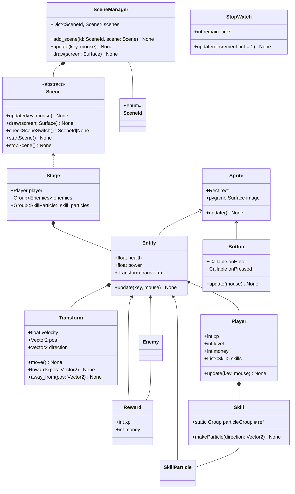

```mermaid
classDiagram


class SceneManager{
    +Dict~SceneId, Scene~ scenes

    +add_scene(id: SceneId, scene: Scene) None
    +update(key, mouse) None
    +draw(screen: Surface) None
}
SceneManager*--Scene
SceneManager--SceneId

class Scene{
    +update(key, mouse) None
    +draw(screen: Surface) None
    +checkSceneSwitch() SceneId|None
    +startScene() None
    +stopScene() None
}
<<abstract>> Scene

class SceneId
<<enum>> SceneId

class Stage{
    +Player player
    +Group~Enemies~ enemies
    +Group~SkillParticle~ skill_particles
}
Scene<..Stage
Stage*--Entity

class Transform{
    +float velocity
    +Vector2 pos
    +Vector2 direction

    +move() None
    +towards(pos: Vector2) None
    +away_from(pos: Vector2) None
}


class Entity{
    +float health
    +float power
    +Transform transform

    +update(key, mouse) None
}
Entity*--Transform

class Sprite{
    +Rect rect
    +pygame.Surface image

    +update() None
}
Sprite<--Entity

class Enemy

class Player{
    +int xp
    +int level
    +int money
    +List~Skill~ skills

    +update(key, mouse) None
}


Entity<--Enemy
Entity<--Player


class Reward{
    +int xp
    +int money
}
Entity<--Reward
Enemy--Reward


class SkillParticle
class Skill{
    +static Group particleGroup # ref

    +makeParticle(direction: Vector2) None
}
Entity<--SkillParticle
Skill--SkillParticle
Player*--Skill


%% helpers
class StopWatch{
    +int remain_ticks
    
    +update(decrement: int = 1) None
}

class Button{
    +Callable onHover
    +Callable onPressed

    +update(mouse) None
}
Sprite<--Button

```